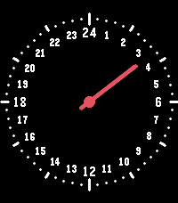
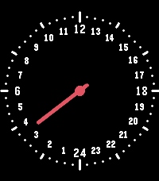

# Dygn

24-hour one-hand watchface for Pebble Time 2 (emery, 200x228). Clone of
[WatchPebble](https://github.com/cy8aer/WatchPebble) by cy8aer, without the
minute hand. One red hand that makes one rotation per day. Midnight (24) at
the top by default, or noon at the top if you prefer.

| 24 at the top (default) | Noon at the top |
|---|---|
|  |  |

## Settings

Phone app, gear icon on the watchface:

- 24 at the top (on by default). Off puts noon at the top and 24 at the bottom.
- 12-hour numerals (off by default)

## Build and install

```
pebble build
pebble install --emulator emery
pebble install --phone <phone ip>     # developer connection on in the Pebble app
```

The bundle is `build/dygn.pbw`; it can also be sideloaded from the phone.

## Store listing

The appstore description is in `DESCRIPTION.txt`.
